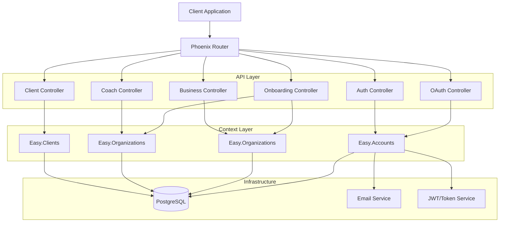
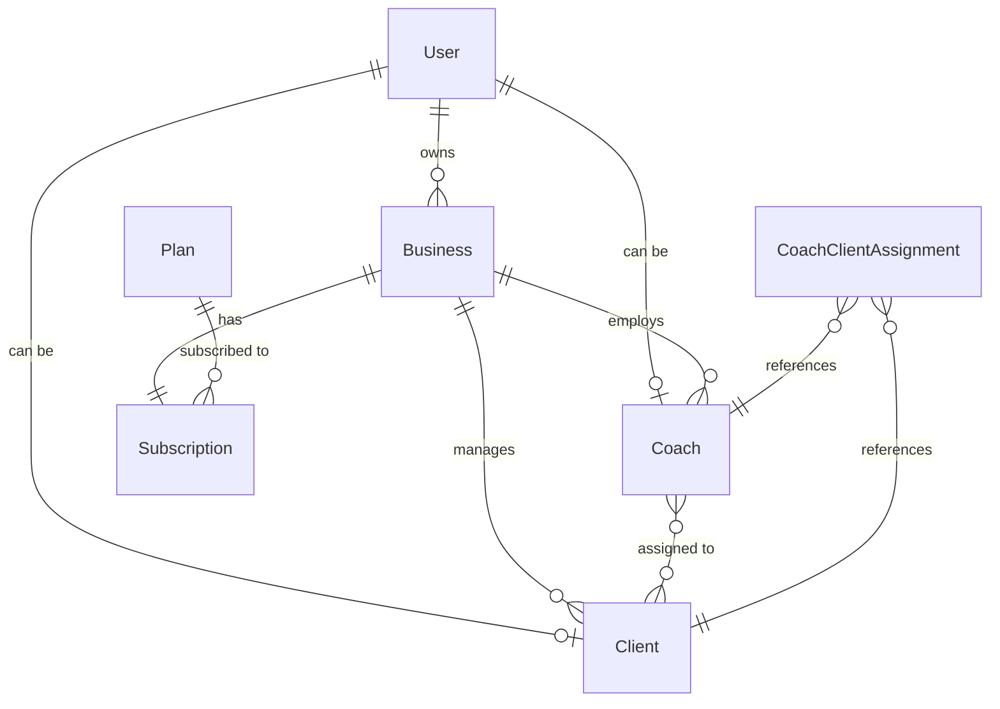

# Design Document

## Overview

This document outlines the technical design for a coaching platform MVP built with Phoenix/Elixir. The platform uses OTP-based passwordless authentication following OAuth 2.0 conventions, multi-tenant architecture with row-level security, and a clean context-driven domain model.

### Key Design Principles

1. **Passwordless Authentication**: OTP-based authentication via email, no password storage
2. **OAuth 2.0 Compatibility**: Standard OAuth endpoints for future extensibility
3. **Multi-Tenancy**: Business-scoped data isolation with row-level security
4. **Context-Driven Design**: Phoenix contexts for clear domain boundaries
5. **API-First**: RESTful JSON API with consistent error handling

## Architecture

### High-Level Architecture



### Context Boundaries

**Easy.Accounts** - User identity and authentication
- **Owns**: User, OneTimeToken, Session schemas
- **Responsibilities**: 
  - User CRUD operations (create, read, update)
  - User lookup by email or ID
  - Email verification status management
  - OTP generation, verification, and lifecycle
  - JWT token creation and validation
  - Session creation, refresh, and revocation
  - Rate limiting for authentication attempts
  - Email delivery for authentication purposes
  - Complete authentication flow orchestration
- **Design Rationale**: For MVP simplicity, user identity and authentication are tightly coupled. Separating them would add unnecessary complexity without clear benefits at this stage.

**Easy.Organizations** - Business and subscription management
- Owns: Business, Plan, Subscription schemas
- Responsibilities: Business CRUD, subscription management, plan management

**Easy.Organizations** - Coach profile management
- Owns: Coach schema
- Responsibilities: Coach CRUD, coach-client assignments, coach queries

**Easy.Clients** - Client management
- Owns: Client, CoachClientAssignment schemas
- Responsibilities: Client CRUD, invitations, client-coach relationships

## Components and Interfaces

### 1. Easy.Accounts Context

**Schema: User**
```elixir
defmodule Easy.Accounts.User do
  schema "users" do
    field :email, :string
    field :full_name, :string
    field :email_verified, :boolean, default: false
    field :email_verified_at, :utc_datetime
    
    has_one :coach, Easy.Organizations.Coach
    has_one :client, Easy.Clients.Client
    has_many :sessions, Easy.Accounts.Session
    has_many :one_time_tokens, Easy.Accounts.OneTimeToken
    
    timestamps()
  end
end
```

**Schema: OneTimeToken**
```elixir
defmodule Easy.Accounts.OneTimeToken do
  schema "one_time_tokens" do
    field :token, :string  # UUID for invitation links
    field :code, :string   # 6-digit OTP code (hashed)
    field :type, :string   # "email_verification", "login", "client_invitation"
    field :email, :string
    field :expires_at, :utc_datetime
    field :used_at, :utc_datetime
    field :attempts, :integer, default: 0
    field :metadata, :map  # For storing invitation context (client_id, business_id, etc)
    
    belongs_to :user, Easy.Accounts.User  # Optional - null during registration
    
    timestamps()
  end
end
```

**Schema: Session**
```elixir
defmodule Easy.Accounts.Session do
  schema "sessions" do
    field :token, :string  # JWT token ID (jti claim)
    field :refresh_token, :string
    field :expires_at, :utc_datetime
    field :last_activity_at, :utc_datetime
    field :revoked_at, :utc_datetime
    
    belongs_to :user, Easy.Accounts.User
    
    timestamps()
  end
end
```

**Public Functions**

*User Management:*
- `create_user(attrs)` - Create new user with email and name
- `get_user(id)` - Get user by ID
- `get_user_by_email(email)` - Get user by email (returns nil if not found)
- `get_user_by_email!(email)` - Get user by email (raises if not found)
- `mark_email_verified(user)` - Mark user's email as verified with timestamp
- `update_user(user, attrs)` - Update user profile attributes
- `email_taken?(email)` - Check if email is already registered

*OTP Management:*
- `generate_otp(email, type, metadata \\ %{})` - Generate OTP, send email, return token UUID
- `verify_otp(email, code, type)` - Verify OTP code, mark as used, return associated data
- `resend_otp(email, type)` - Invalidate old OTP and generate new one
- `check_rate_limit(email)` - Check if email has exceeded OTP request limit
- `get_invitation_token(token)` - Get invitation token by UUID (for client invitations)

*Session Management:*
- `create_session(user)` - Create session record and return JWT access + refresh tokens
- `refresh_session(refresh_token)` - Validate refresh token and issue new access token
- `revoke_session(token)` - Mark session as revoked
- `revoke_all_user_sessions(user_id)` - Revoke all sessions for a user
- `get_session_by_token(token)` - Get session record by JWT ID
- `cleanup_expired_sessions()` - Remove expired sessions (background job)

*Authentication Flows:*
- `register_user(email, full_name)` - Create user + send verification OTP
- `verify_and_login(email, code)` - Verify OTP + mark email verified + create session
- `request_login_otp(email)` - Send login OTP to existing user
- `login_with_otp(email, code)` - Verify login OTP + create session

**Design Rationale:**
- Single context for all user and authentication concerns keeps MVP simple
- All user-related schemas (User, OneTimeToken, Session) in one place
- Clear public API for authentication flows
- Easy to split into separate contexts later if needed

**JWT Token Structure**
```elixir
# Access Token Claims
%{
  "sub" => user_id,
  "email" => user.email,
  "roles" => ["coach", "client"],  # User's roles
  "exp" => expires_at,
  "iat" => issued_at,
  "jti" => session_id
}

# Refresh Token Claims
%{
  "sub" => user_id,
  "type" => "refresh",
  "exp" => expires_at,
  "jti" => session_id
}
```

### 2. Easy.Organizations Context

**Schema: Business**
```elixir
defmodule Easy.Organizations.Business do
  schema "businesses" do
    field :name, :string
    field :description, :string
    field :slug, :string
    field :status, :string, default: "active"
    
    belongs_to :owner, Easy.Accounts.User
    has_many :coaches, Easy.Organizations.Coach
    has_many :clients, Easy.Clients.Client
    has_one :subscription, Easy.Organizations.Subscription
    
    timestamps()
  end
end
```

**Schema: Plan**
```elixir
defmodule Easy.Organizations.Plan do
  schema "plans" do
    field :name, :string
    field :slug, :string
    field :description, :string
    field :price_cents, :integer
    field :billing_interval, :string  # "month", "year"
    field :features, :map
    field :limits, :map  # %{max_coaches: 1, max_clients: 10}
    field :is_default, :boolean, default: false
    
    has_many :subscriptions, Easy.Organizations.Subscription
    
    timestamps()
  end
end
```

**Schema: Subscription**
```elixir
defmodule Easy.Organizations.Subscription do
  schema "subscriptions" do
    field :status, :string  # "active", "cancelled", "expired"
    field :started_at, :utc_datetime
    field :current_period_start, :utc_datetime
    field :current_period_end, :utc_datetime
    field :cancelled_at, :utc_datetime
    
    belongs_to :business, Easy.Organizations.Business
    belongs_to :plan, Easy.Organizations.Plan
    
    timestamps()
  end
end
```

**Public Functions**
- `create_business(user, attrs)` - Create business with owner
- `get_business(id)` - Get business by ID
- `update_business(business, attrs)` - Update business
- `list_business_coaches(business_id)` - List coaches in business
- `list_business_clients(business_id, opts)` - List clients with pagination
- `get_or_create_default_plan()` - Get or create default free plan
- `create_subscription(business, plan)` - Create subscription
- `get_subscription(business_id)` - Get active subscription

### 3. Easy.Organizations Context

**Schema: Coach**
```elixir
defmodule Easy.Organizations.Coach do
  schema "coaches" do
    field :bio, :string
    field :specialties, {:array, :string}
    field :credentials, :map
    field :status, :string, default: "active"
    
    belongs_to :user, Easy.Accounts.User
    belongs_to :business, Easy.Organizations.Business
    many_to_many :clients, Easy.Clients.Client, 
      join_through: Easy.Clients.CoachClientAssignment
    
    timestamps()
  end
end
```

**Public Functions**
- `create_coach(user, business, attrs)` - Create coach profile
- `get_coach(id)` - Get coach by ID
- `update_coach(coach, attrs)` - Update coach profile
- `list_coach_clients(coach_id)` - List assigned clients
- `assign_client(coach_id, client_id)` - Assign client to coach
- `unassign_client(coach_id, client_id)` - Remove assignment

### 4. Easy.Clients Context

**Schema: Client**
```elixir
defmodule Easy.Clients.Client do
  schema "clients" do
    field :email, :string
    field :full_name, :string
    field :phone, :string
    field :notes, :string
    field :status, :string  # "pending", "active", "inactive", "archived"
    
    belongs_to :user, Easy.Accounts.User
    belongs_to :business, Easy.Organizations.Business
    many_to_many :coaches, Easy.Organizations.Coach,
      join_through: Easy.Clients.CoachClientAssignment
    
    timestamps()
  end
end
```

**Schema: CoachClientAssignment**
```elixir
defmodule Easy.Clients.CoachClientAssignment do
  schema "coach_client_assignments" do
    field :assigned_at, :utc_datetime
    field :assigned_by_id, :id  # User who created assignment
    
    belongs_to :coach, Easy.Organizations.Coach
    belongs_to :client, Easy.Clients.Client
    
    timestamps()
  end
end
```

**Public Functions**
- `create_invitation(coach, attrs)` - Create client invitation
- `get_invitation(token)` - Get invitation by token
- `accept_invitation(token)` - Accept invitation and send OTP
- `complete_client_registration(token, otp_code, user)` - Complete registration
- `get_client(id)` - Get client by ID
- `update_client(client, attrs)` - Update client
- `list_clients(business_id, opts)` - List clients with filters
- `list_client_coaches(client_id)` - List assigned coaches
- `update_client_status(client, status)` - Update client status

## Data Models

### Database Schema

```sql
-- Users table
CREATE TABLE users (
  id BIGSERIAL PRIMARY KEY,
  email VARCHAR(255) NOT NULL UNIQUE,
  full_name VARCHAR(255) NOT NULL,
  email_verified BOOLEAN DEFAULT FALSE,
  email_verified_at TIMESTAMP,
  inserted_at TIMESTAMP NOT NULL,
  updated_at TIMESTAMP NOT NULL
);

CREATE INDEX users_email_index ON users(email);

-- One-time tokens table
CREATE TABLE one_time_tokens (
  id BIGSERIAL PRIMARY KEY,
  token VARCHAR(255) NOT NULL UNIQUE,
  code VARCHAR(6) NOT NULL,
  type VARCHAR(50) NOT NULL,
  email VARCHAR(255) NOT NULL,
  expires_at TIMESTAMP NOT NULL,
  used_at TIMESTAMP,
  attempts INTEGER DEFAULT 0,
  metadata JSONB,
  user_id BIGINT REFERENCES users(id),
  inserted_at TIMESTAMP NOT NULL,
  updated_at TIMESTAMP NOT NULL
);

CREATE INDEX one_time_tokens_token_index ON one_time_tokens(token);
CREATE INDEX one_time_tokens_email_type_index ON one_time_tokens(email, type);
CREATE INDEX one_time_tokens_expires_at_index ON one_time_tokens(expires_at);

-- Sessions table
CREATE TABLE sessions (
  id BIGSERIAL PRIMARY KEY,
  token VARCHAR(255) NOT NULL UNIQUE,
  refresh_token VARCHAR(255) NOT NULL UNIQUE,
  expires_at TIMESTAMP NOT NULL,
  last_activity_at TIMESTAMP NOT NULL,
  revoked_at TIMESTAMP,
  user_id BIGINT NOT NULL REFERENCES users(id),
  inserted_at TIMESTAMP NOT NULL,
  updated_at TIMESTAMP NOT NULL
);

CREATE INDEX sessions_user_id_index ON sessions(user_id);
CREATE INDEX sessions_token_index ON sessions(token);
CREATE INDEX sessions_refresh_token_index ON sessions(refresh_token);

-- Plans table
CREATE TABLE plans (
  id BIGSERIAL PRIMARY KEY,
  name VARCHAR(255) NOT NULL,
  slug VARCHAR(255) NOT NULL UNIQUE,
  description TEXT,
  price_cents INTEGER NOT NULL,
  billing_interval VARCHAR(50) NOT NULL,
  features JSONB,
  limits JSONB,
  is_default BOOLEAN DEFAULT FALSE,
  inserted_at TIMESTAMP NOT NULL,
  updated_at TIMESTAMP NOT NULL
);

-- Businesses table
CREATE TABLE businesses (
  id BIGSERIAL PRIMARY KEY,
  name VARCHAR(255) NOT NULL UNIQUE,
  description TEXT,
  slug VARCHAR(255) NOT NULL UNIQUE,
  status VARCHAR(50) DEFAULT 'active',
  owner_id BIGINT NOT NULL REFERENCES users(id),
  inserted_at TIMESTAMP NOT NULL,
  updated_at TIMESTAMP NOT NULL
);

CREATE INDEX businesses_owner_id_index ON businesses(owner_id);
CREATE INDEX businesses_slug_index ON businesses(slug);

-- Subscriptions table
CREATE TABLE subscriptions (
  id BIGSERIAL PRIMARY KEY,
  status VARCHAR(50) NOT NULL,
  started_at TIMESTAMP NOT NULL,
  current_period_start TIMESTAMP NOT NULL,
  current_period_end TIMESTAMP NOT NULL,
  cancelled_at TIMESTAMP,
  business_id BIGINT NOT NULL REFERENCES businesses(id),
  plan_id BIGINT NOT NULL REFERENCES plans(id),
  inserted_at TIMESTAMP NOT NULL,
  updated_at TIMESTAMP NOT NULL
);

CREATE INDEX subscriptions_business_id_index ON subscriptions(business_id);
CREATE UNIQUE INDEX subscriptions_business_active_index 
  ON subscriptions(business_id) WHERE status = 'active';

-- Coaches table
CREATE TABLE coaches (
  id BIGSERIAL PRIMARY KEY,
  bio TEXT,
  specialties TEXT[],
  credentials JSONB,
  status VARCHAR(50) DEFAULT 'active',
  user_id BIGINT NOT NULL REFERENCES users(id),
  business_id BIGINT NOT NULL REFERENCES businesses(id),
  inserted_at TIMESTAMP NOT NULL,
  updated_at TIMESTAMP NOT NULL
);

CREATE INDEX coaches_user_id_index ON coaches(user_id);
CREATE INDEX coaches_business_id_index ON coaches(business_id);
CREATE UNIQUE INDEX coaches_user_business_index ON coaches(user_id, business_id);

-- Clients table
CREATE TABLE clients (
  id BIGSERIAL PRIMARY KEY,
  email VARCHAR(255) NOT NULL,
  full_name VARCHAR(255) NOT NULL,
  phone VARCHAR(50),
  notes TEXT,
  status VARCHAR(50) DEFAULT 'pending',
  user_id BIGINT REFERENCES users(id),
  business_id BIGINT NOT NULL REFERENCES businesses(id),
  inserted_at TIMESTAMP NOT NULL,
  updated_at TIMESTAMP NOT NULL
);

CREATE INDEX clients_user_id_index ON clients(user_id);
CREATE INDEX clients_business_id_index ON clients(business_id);
CREATE INDEX clients_email_index ON clients(email);
CREATE UNIQUE INDEX clients_user_business_index ON clients(user_id, business_id) 
  WHERE user_id IS NOT NULL;

-- Coach-Client Assignments table
CREATE TABLE coach_client_assignments (
  id BIGSERIAL PRIMARY KEY,
  assigned_at TIMESTAMP NOT NULL,
  assigned_by_id BIGINT,
  coach_id BIGINT NOT NULL REFERENCES coaches(id) ON DELETE CASCADE,
  client_id BIGINT NOT NULL REFERENCES clients(id) ON DELETE CASCADE,
  inserted_at TIMESTAMP NOT NULL,
  updated_at TIMESTAMP NOT NULL
);

CREATE INDEX coach_client_assignments_coach_id_index ON coach_client_assignments(coach_id);
CREATE INDEX coach_client_assignments_client_id_index ON coach_client_assignments(client_id);
CREATE UNIQUE INDEX coach_client_assignments_unique_index 
  ON coach_client_assignments(coach_id, client_id);
```

### Entity Relationships



## Error Handling

### OAuth Error Responses

Following RFC 6749, OAuth endpoints return errors in this format:

```json
{
  "error": "invalid_grant",
  "error_description": "The provided OTP code is invalid or has expired"
}
```

**OAuth Error Codes:**
- `invalid_request` - Missing or invalid parameters
- `invalid_grant` - Invalid OTP code or expired token
- `invalid_token` - Expired or revoked access token
- `slow_down` - Rate limit exceeded
- `unauthorized_client` - Client not authorized

### Standard API Error Responses

Non-OAuth endpoints return errors in this format:

```json
{
  "error": {
    "message": "Validation failed",
    "code": "validation_error",
    "details": {
      "email": ["has already been taken"],
      "full_name": ["can't be blank"]
    }
  }
}
```

**HTTP Status Codes:**
- `400` - Validation errors, bad requests
- `401` - Authentication required (with `WWW-Authenticate: Bearer` header)
- `403` - Authorization failed (insufficient permissions)
- `404` - Resource not found
- `422` - Unprocessable entity (business logic errors)
- `429` - Rate limit exceeded (with `Retry-After` header)
- `500` - Internal server error

### Error Handling Strategy

1. **Validation Errors**: Use Ecto changesets, return field-level errors
2. **Authentication Errors**: Return OAuth-compliant errors for OAuth endpoints
3. **Authorization Errors**: Check permissions in plugs, return 403 with clear message
4. **Rate Limiting**: Track in-memory (ETS) or Redis, return 429 with retry time
5. **Not Found**: Return 404 with generic message (avoid information leakage)
6. **Internal Errors**: Log full error, return sanitized 500 response

## Testing Strategy

### Unit Tests

**Context Tests** - Test business logic in isolation
- `Easy.Accounts` - User creation, email validation
- `Easy.Auth` - OTP generation/verification, JWT creation, rate limiting
- `Easy.Organizations` - Business creation, subscription management
- `Easy.Organizations` - Coach CRUD, assignments
- `Easy.Clients` - Client CRUD, invitations, assignments

**Schema Tests** - Test validations and constraints
- Required fields
- Format validations (email, phone)
- Unique constraints
- Association loading

### Integration Tests

**Controller Tests** - Test HTTP endpoints
- OAuth endpoints (`/oauth/token`, `/oauth/authorize`, `/oauth/revoke`)
- Auth endpoints (`/api/auth/register`)
- Onboarding endpoints (`/api/onboarding/business`)
- Business endpoints (CRUD operations)
- Coach endpoints (CRUD, assignments)
- Client endpoints (CRUD, invitations, assignments)

**Authentication Flow Tests** - Test complete flows
- Coach signup flow (register → verify OTP → create business)
- Client invitation flow (invite → accept → verify OTP)
- Login flow (request OTP → verify → get tokens)
- Token refresh flow
- Token revocation

### Test Data Strategy

- Use `ExMachina` for test data factories
- Create factory for each schema
- Use `build` for unit tests (no DB)
- Use `insert` for integration tests (with DB)
- Clean database between tests

## Security Considerations

### OTP Security

1. **Generation**: Use cryptographically secure random number generator
2. **Storage**: Hash OTP codes before storing (use bcrypt or argon2)
3. **Expiration**: 10 minutes for auth, 7 days for invitations
4. **Attempts**: Maximum 3 attempts before requiring new OTP
5. **Rate Limiting**: 3 OTP requests per email per 15 minutes
6. **Invalidation**: Invalidate previous OTP when new one is requested

### JWT Security

1. **Signing**: Use RS256 (asymmetric) for production
2. **Expiration**: Access token 7 days, refresh token 30 days
3. **Claims**: Include minimal data (user_id, email, roles)
4. **Revocation**: Store session in DB, check on sensitive operations
5. **Rotation**: Rotate refresh tokens on use

### Authorization

1. **Row-Level Security**: Filter queries by business_id
2. **Ownership Checks**: Verify user owns/belongs to resource
3. **Role Checks**: Verify user has required role (coach, owner)
4. **Plug Pipeline**: Authenticate → Load User → Authorize

### Data Protection

1. **Email Validation**: Validate format, check deliverability
2. **Input Sanitization**: Strip HTML, prevent injection
3. **SQL Injection**: Use Ecto parameterized queries
4. **CORS**: Configure allowed origins
5. **Rate Limiting**: Protect all endpoints

## Performance Considerations

### Database Optimization

1. **Indexes**: Add indexes on foreign keys and frequently queried fields
2. **Pagination**: Use cursor-based pagination for large datasets
3. **Preloading**: Use `Repo.preload` to avoid N+1 queries
4. **Connection Pooling**: Configure appropriate pool size

### Caching Strategy

1. **Plans**: Cache in memory (rarely change)
2. **Business Data**: Cache with TTL (5 minutes)
3. **User Roles**: Include in JWT (no DB lookup)
4. **Rate Limits**: Use ETS or Redis

### Email Delivery

1. **Async**: Send emails in background jobs
2. **Queuing**: Use Oban for job processing
3. **Templates**: Pre-compile email templates
4. **Provider**: Use transactional email service (SendGrid, Postmark)

## Deployment Considerations

### Environment Configuration

```elixir
# config/runtime.exs
config :easy, Easy.Auth,
  otp_expiration_minutes: 10,
  invitation_expiration_days: 7,
  max_otp_attempts: 3,
  rate_limit_window_minutes: 15,
  rate_limit_max_requests: 3

config :easy, Easy.Auth.Guardian,
  issuer: "easy",
  secret_key: System.get_env("GUARDIAN_SECRET_KEY"),
  ttl: {7, :days}

config :easy, Easy.Mailer,
  adapter: Swoosh.Adapters.Postmark,
  api_key: System.get_env("POSTMARK_API_KEY")
```

### Database Migrations

Run migrations in order:
1. Create users table
2. Create one_time_tokens table
3. Create sessions table
4. Create plans table (with seed data)
5. Create businesses table
6. Create subscriptions table
7. Create coaches table
8. Create clients table
9. Create coach_client_assignments table

### Monitoring

1. **Metrics**: Track OTP generation/verification rates
2. **Errors**: Monitor failed authentication attempts
3. **Performance**: Track endpoint response times
4. **Rate Limits**: Alert on frequent rate limit hits
5. **Email Delivery**: Monitor bounce rates

## API Documentation

### Authentication Flow Examples

**Coach Signup Flow**

```bash
# Step 1: Register
POST /api/auth/register
{
  "email": "coach@example.com",
  "full_name": "John Coach"
}

Response 200:
{
  "user_id": "123",
  "status": "verification_pending"
}

# Step 2: Verify OTP
POST /oauth/token
{
  "grant_type": "otp",
  "email": "coach@example.com",
  "code": "123456"
}

Response 200:
{
  "access_token": "eyJhbGc...",
  "refresh_token": "eyJhbGc...",
  "token_type": "Bearer",
  "expires_in": 604800
}

# Step 3: Create Business
POST /api/onboarding/business
Authorization: Bearer eyJhbGc...
{
  "name": "Coaching Pro",
  "description": "Professional coaching services"
}

Response 201:
{
  "business": {
    "id": "456",
    "name": "Coaching Pro",
    "slug": "coaching-pro"
  },
  "coach": {
    "id": "789",
    "user_id": "123",
    "business_id": "456"
  },
  "subscription": {
    "id": "101",
    "plan": "Free",
    "status": "active"
  }
}
```

**Client Invitation Flow**

```bash
# Step 1: Coach invites client
POST /api/clients/invite
Authorization: Bearer eyJhbGc...
{
  "email": "client@example.com",
  "full_name": "Jane Client",
  "phone": "+1234567890"
}

Response 201:
{
  "client": {
    "id": "202",
    "email": "client@example.com",
    "status": "pending"
  },
  "invitation_url": "https://app.example.com/invite/abc123"
}

# Step 2: Client validates invitation
GET /api/invitations/abc123

Response 200:
{
  "client": {
    "email": "client@example.com",
    "full_name": "Jane Client"
  },
  "business": {
    "name": "Coaching Pro"
  },
  "coach": {
    "full_name": "John Coach"
  }
}

# Step 3: Client accepts invitation
POST /api/invitations/abc123/accept

Response 200:
{
  "status": "verification_pending"
}

# Step 4: Client verifies OTP
POST /oauth/token
{
  "grant_type": "otp",
  "email": "client@example.com",
  "code": "654321",
  "invitation_token": "abc123"
}

Response 200:
{
  "access_token": "eyJhbGc...",
  "refresh_token": "eyJhbGc...",
  "token_type": "Bearer",
  "expires_in": 604800,
  "user": {
    "id": "303",
    "email": "client@example.com",
    "roles": ["client"]
  },
  "client": {
    "id": "202",
    "status": "active"
  }
}
```

**Login Flow**

```bash
# Step 1: Request OTP
POST /oauth/authorize
{
  "email": "coach@example.com"
}

Response 200:
{
  "status": "verification_pending"
}

# Step 2: Verify OTP
POST /oauth/token
{
  "grant_type": "otp",
  "email": "coach@example.com",
  "code": "123456"
}

Response 200:
{
  "access_token": "eyJhbGc...",
  "refresh_token": "eyJhbGc...",
  "token_type": "Bearer",
  "expires_in": 604800
}
```

## Future Enhancements

### Phase 2 Features

1. **OAuth Providers**: Add Google, Microsoft OAuth
2. **Multi-Business Support**: Allow users to belong to multiple businesses
3. **Role Management**: Add granular permissions (admin, coach, viewer)
4. **Audit Logging**: Track all data changes
5. **Webhooks**: Notify external systems of events

### Scalability Improvements

1. **Read Replicas**: Separate read/write database connections
2. **Caching Layer**: Add Redis for session/rate limit storage
3. **CDN**: Serve static assets from CDN
4. **Background Jobs**: Move email sending to Oban
5. **API Versioning**: Add `/v1/` prefix for future versions
