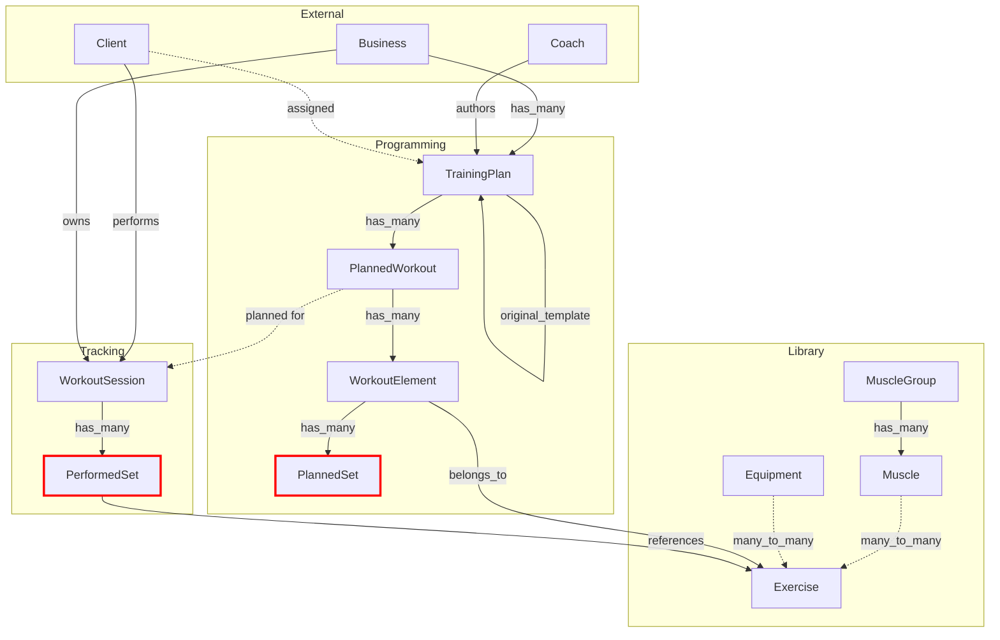

# Training Datamodels - Consolidated Analysis Report

> **Report Status**: This consolidates findings from multiple independent analyses of the `Easy.Training` domain schemas and contexts.

---

## 📊 Architecture Overview

The Training domain is well-organized into three sub-contexts:

1. **Library** - Exercise catalog (muscles, equipment, exercises)
2. **Programming** - Training plan design (plans, workouts, elements, sets)
3. **Tracking** - Workout execution logging (sessions, performed sets)

All schemas use a shared kernel ([schema.ex](file:///Users/vikassandhu/Desktop/10x/easy-backend/lib/easy/training/schema.ex)) enforcing:
- Binary IDs (UUIDs) for primary keys
- Binary foreign keys  
- Microsecond-precision UTC timestamps

### Schema Relationship Map



*Red highlight indicates missing linkage between `PerformedSet` and `PlannedSet`*

---

## 🚨 Critical Issues (P0)

### 1. Security: Missing `business_id` Authorization in Template Assignment

**Severity**: CRITICAL - Authorization Bypass  
**Location**: [programming.ex:390-414](file:///Users/vikassandhu/Desktop/10x/easy-backend/lib/easy/training/programming.ex#L390-L414)

```elixir
def assign_training_plan_to_client(template_id, client_id, start_date \\ nil) do
  template =
    Repo.get!(TrainingPlan, template_id)  # ❌ No business_id check!
    |> Repo.preload(...)
```

**Impact**: A malicious user could assign ANY business's training plan template to their client by just knowing the template UUID.

**Fix Required**:
```elixir
def assign_training_plan_to_client(business_id, template_id, client_id, start_date \\ nil)
```

Then validate:
```elixir
with {:ok, template} <- fetch_training_plan(business_id, template_id) do
  # ... rest of logic
end
```

---

### 2. AGENTS.md Violation: `business_id` in `cast/3`

**Severity**: CRITICAL - Security Best Practice Violation  
**Location**: [workout_session.ex:28-37](file:///Users/vikassandhu/Desktop/10x/easy-backend/lib/easy/training/tracking/workout_session.ex#L28-L37)

```elixir
def changeset(workout_session, attrs) do
  workout_session
  |> cast(attrs, [
    :started_at,
    :ended_at,
    :state,
    :soreness_rating,
    :notes,
    :client_id,
    :business_id,  # ❌ AGENTS.md: "Restricted fields must NOT be in cast/3"
    :planned_workout_id
  ])
```

**Impact**: Allows API users to potentially override `business_id`, breaking tenant isolation.

**Fix Required**: Remove `business_id` from `cast/3`. Set it programmatically in context layer:

```elixir
# In tracking.ex
def create_session(business_id, attrs) do
  %WorkoutSession{}
  |> WorkoutSession.changeset(attrs)
  |> Ecto.Changeset.put_change(:business_id, business_id)
  |> Repo.insert()
end
```

---

### 3. AGENTS.md Violation: Missing `business_id` Filtering in Queries

**Severity**: CRITICAL - Potential Data Leakage  
**Location**: [tracking.ex:13-20](file:///Users/vikassandhu/Desktop/10x/easy-backend/lib/easy/training/tracking.ex#L13-L20)

```elixir
def list_sessions(opts \\ []) do
  client_id = Keyword.get(opts, :client_id)

  WorkoutSession
  |> filter_by_client(client_id)  # ✅ Filters by client
  # ❌ NO business_id filter!
  |> order_by([s], desc: s.started_at)
  |> Repo.all()
end
```

**Also Missing In**:
- [library.ex:14](file:///Users/vikassandhu/Desktop/10x/easy-backend/lib/easy/training/library.ex#L14) - `list_muscle_groups/0`
- [tracking.ex:28](file:///Users/vikassandhu/Desktop/10x/easy-backend/lib/easy/training/tracking.ex#L28) - `get_session!/1`

**Fix Required**: Add `business_id` parameter to ALL query functions:

```elixir
def list_sessions(business_id, opts \\ []) do
  client_id = Keyword.get(opts, :client_id)

  WorkoutSession
  |> where([s], s.business_id == ^business_id)
  |> filter_by_client(client_id)
  |> order_by([s], desc: s.started_at)
  |> Repo.all()
end
```

---

### 4. Missing Testing Infrastructure

**Severity**: CRITICAL - No Safety Net  
**Location**: `test/easy/training` (directory does not exist)

**Impact**: Complex business logic (deep copying, state machines, validations) is completely untested. High risk of regressions.

**Fix Required**: Implement comprehensive test suite covering:
- Unit tests for all changesets and validations
- Integration tests for context functions
- Transaction tests for copy-on-assignment logic
- Authorization tests for business_id scoping

---

## 🔴 High Priority Issues (P1)

### 5. Missing Unique Constraints - Data Corruption Risk

**Severity**: HIGH - Data Integrity  
**Affected Schemas**: [PlannedWorkout](file:///Users/vikassandhu/Desktop/10x/easy-backend/lib/easy/training/programming/planned_workout.ex), [PlannedSet](file:///Users/vikassandhu/Desktop/10x/easy-backend/lib/easy/training/programming/planned_set.ex), [PerformedSet](file:///Users/vikassandhu/Desktop/10x/easy-backend/lib/easy/training/tracking/performed_set.ex)

**Missing Constraints**:
1. `PlannedWorkout` - (training_plan_id, day_number)
2. `PlannedSet` - (workout_element_id, position)  
3. `PerformedSet` - (workout_session_id, position)

**Current Risk**: Could create:
- Training plan with 3 "Day 1" workouts
- Workout element with 2 sets at position 0
- Workout session with 5 sets all at position 1

**Fix Required**:
```elixir
# In schemas, add:
|> unique_constraint([:training_plan_id, :day_number])
|> unique_constraint([:workout_element_id, :position])
|> unique_constraint([:workout_session_id, :position])

# Migrations needed for database indexes
```

---

### 6. Type Safety: `ExerciseMuscle.role` Uses Plain String

**Severity**: HIGH - Type Safety  
**Location**: [exercise_muscle.ex:13](file:///Users/vikassandhu/Desktop/10x/easy-backend/lib/easy/training/library/exercise_muscle.ex#L13)

**Current**:
```elixir
field :role, :string, default: "primary"
```

**Problems**:
- No validation - could store "prmiary", "SECONDARY", "target", etc.
- Hardcoded default in multiple places ([exercise.ex:42,51](file:///Users/vikassandhu/Desktop/10x/easy-backend/lib/easy/training/library/exercise.ex#L42))

**Fix Required**:
```elixir
field :role, Ecto.Enum, values: [:primary, :secondary, :stabilizer], default: :primary

# Update changeset in exercise.ex to use atoms
exercise_muscles = Enum.map(muscle_ids, &%{muscle_id: &1, role: :primary})
```

---

### 7. Redundant Schema Declarations in Join Tables

**Severity**: MEDIUM - Code Quality  
**Location**: [ExerciseMuscle](file:///Users/vikassandhu/Desktop/10x/easy-backend/lib/easy/training/library/exercise_muscle.ex#L6-L8), [ExerciseEquipment](file:///Users/vikassandhu/Desktop/10x/easy-backend/lib/easy/training/library/exercise_equipment.ex#L6-L8)

Both schemas inherit from `Easy.Training.Schema` but re-declare:

```elixir
@primary_key {:id, :binary_id, autogenerate: true}
@foreign_key_type :binary_id
timestamps(type: :utc_datetime_usec)  # Already in parent!
```

**Impact**: Confusing. Potential inconsistency if parent changes.

**Fix**: Remove redundant declarations, rely on `use Easy.Training.Schema`.

---

## 🟡 Medium Priority Issues (P2)

### 8. `PlannedWorkout.day_number` Lacks Upper Bound Validation

**Severity**: MEDIUM - Data Quality  
**Location**: [planned_workout.ex:25](file:///Users/vikassandhu/Desktop/10x/easy-backend/lib/easy/training/programming/planned_workout.ex#L25)

**Current**:
```elixir
|> validate_number(:day_number, greater_than_or_equal_to: 1)
# ❌ No upper bound!
```

**Scenario**:
- TrainingPlan has `duration_weeks: 4` (28 days)
- PlannedWorkout could have `day_number: 1000`

**Fix**:
```elixir
# Add cross-field validation in PlannedWorkout.changeset
defp validate_day_number_in_range(changeset) do
  case fetch_field(changeset, :training_plan_id) do
    {_, plan_id} when not is_nil(plan_id) ->
      plan = Repo.get!(TrainingPlan, plan_id)
      max_days = (plan.duration_weeks || 52) * 7
      validate_number(changeset, :day_number, less_than_or_equal_to: max_days)
    _ ->
      changeset
  end
end
```

---

### 9. Missing Enum Values in `PlannedSet.load_type`

**Severity**: MEDIUM - Feature Gap  
**Location**: [planned_set.ex:11](file:///Users/vikassandhu/Desktop/10x/easy-backend/lib/easy/training/programming/planned_set.ex#L11)

**Current**:
```elixir
field :load_type, Ecto.Enum, values: [:absolute_kg, :percent_1rm, :rpe]
```

**Missing Values**:
- `:bodyweight` - for exercises like push-ups, pull-ups
- `:absolute_lbs` - for US users who don't use metric

**Fix**:
```elixir
field :load_type, Ecto.Enum, 
  values: [:absolute_kg, :absolute_lbs, :bodyweight, :percent_1rm, :rpe]
```

---

### 10. Hardcoded Metric Units in `PerformedSet`

**Severity**: MEDIUM - Internationalization  
**Location**: [performed_set.ex:10](file:///Users/vikassandhu/Desktop/10x/easy-backend/lib/easy/training/tracking/performed_set.ex#L10)

**Current**:
```elixir
field :weight_kg, :decimal
```

**Impact**: 
- Application must convert lbs → kg before saving
- Requires strict frontend/API discipline
- Cannot preserve original input unit

**Options**:
1. **Keep as-is** but document conversion requirement
2. **Store both**: `weight_value` (decimal) + `weight_unit` (enum: kg/lbs)

---

### 11. Missing Superset Group Tracking in `PerformedSet`

**Severity**: MEDIUM - Analytics Gap  
**Comparison**: [WorkoutElement](file:///Users/vikassandhu/Desktop/10x/easy-backend/lib/easy/training/programming/workout_element.ex#L9) has `superset_group_id`, PerformedSet doesn't

**Impact**: Cannot reconstruct actual execution flow:
- Did user actually alternate superset exercises?
- What were rest times between superset exercises?

**Fix** (if detailed tracking needed):
```elixir
# Add to PerformedSet
field :superset_group_id, :string
field :completed_at, :utc_datetime_usec  # For rest time calculations
```

---

### 12. Inconsistent Reference Data Scoping

**Severity**: MEDIUM - Design Decision  
**Affected**: [Muscle](file:///Users/vikassandhu/Desktop/10x/easy-backend/lib/easy/training/library/muscle.ex), [MuscleGroup](file:///Users/vikassandhu/Desktop/10x/easy-backend/lib/easy/training/library/muscle_group.ex), [Equipment](file:///Users/vikassandhu/Desktop/10x/easy-backend/lib/easy/training/library/equipment.ex)

**Current**:
- `Exercise` → hybrid scoping (null or business_id)
- `Muscle`, `MuscleGroup`, `Equipment` → global (no business_id)

**Impact**: 
- All businesses share same muscle/equipment catalog
- Cannot create business-specific muscle definitions

**Decision Required**:
1. **Keep global** - document as intentional system-wide reference data
2. **Add hybrid scoping** - allow business overrides like Exercise

---

### 13. `WorkoutElement.superset_group_id` is Unvalidated String

**Severity**: LOW - Data Quality  
**Location**: [workout_element.ex:9](file:///Users/vikassandhu/Desktop/10x/easy-backend/lib/easy/training/programming/workout_element.ex#L9)

**Current**: Plain string, no validation or referential integrity

**Options**:
1. Continue as string (human-readable grouping like "A", "B", "C")
2. Use UUID for more robust tracking
3. Create separate `SupersetGroup` table with FK

---

### 14. No Soft Delete Support

**Severity**: LOW - Compliance  
**Affected**: All schemas use hard delete via `Repo.delete/1`

**Impact**: 
- No audit trail for deleted records
- Cannot recover accidentally deleted training plans
- May violate compliance requirements (GDPR data retention)

**Fix** (if needed):
- Add `deleted_at` timestamp to schemas
- Update context functions to filter out soft-deleted records
- Provide separate hard delete for GDPR compliance

---

### 15. Duplicate Changeset Logic in Exercise

**Severity**: LOW - Code Quality  
**Location**: [exercise.ex:39-79](file:///Users/vikassandhu/Desktop/10x/easy-backend/lib/easy/training/library/exercise.ex#L39-L79)

`put_muscle_ids` and `put_equipment_ids` have duplicate implementations for string keys vs atom keys.

**Fix**: Normalize keys at changeset entry or combine implementations.

---

## ✅ What's Done Well

| Aspect | Details |
|--------|---------|
| **Domain Separation** | Clear Library/Programming/Tracking boundaries |
| **Template Pattern** | Excellent copy-on-assignment with `Ecto.Multi` transactions |
| **UUID Primary Keys** | Consistent use via shared `Schema` module |
| **Context Pattern** | Proper `{:ok, result}` / `{:error, reason}` tuples |
| **Preloading** | Associations loaded at context layer, avoiding N+1 |
| **Validations** | Good use of `validate_number`, custom validators like `validate_rep_range` |
| **State Machines** | WorkoutSession lifecycle (active → completed/discarded) |
| **Self-Reference** | TrainingPlan tracks `original_template_id` for audit trail |
| **Hybrid Scoping** | Exercise supports both system + business-specific |

---

## 🛠️ Prioritized Fix Roadmap

### Phase 1: Security & Critical Bugs (P0)

| Fix | Effort | Files |
|-----|--------|-------|
| Add `business_id` param to `assign_training_plan_to_client` | 1h | [programming.ex](file:///Users/vikassandhu/Desktop/10x/easy-backend/lib/easy/training/programming.ex#L390) |
| Remove `business_id` from `WorkoutSession.changeset` cast | 30m | [workout_session.ex](file:///Users/vikassandhu/Desktop/10x/easy-backend/lib/easy/training/tracking/workout_session.ex#L35) |
| Add `business_id` filter to `list_sessions` | 30m | [tracking.ex](file:///Users/vikassandhu/Desktop/10x/easy-backend/lib/easy/training/tracking.ex#L13) |
| Add `business_id` filter to `get_session!` | 20m | [tracking.ex](file:///Users/vikassandhu/Desktop/10x/easy-backend/lib/easy/training/tracking.ex#L28) |
| Add `business_id` param to `list_muscle_groups` | 30m | [library.ex](file:///Users/vikassandhu/Desktop/10x/easy-backend/lib/easy/training/library.ex#L14) |

### Phase 2: Data Integrity (P1)

| Fix | Effort | Files |
|-----|--------|-------|
| Add unique indexes for positions | 1h | 3 migrations |
| Convert `ExerciseMuscle.role` to enum | 1.5h | Migration + 2 schemas |
| Remove redundant schema declarations | 30m | 2 join table schemas |

### Phase 3: Testing Infrastructure (P0 - Can Run in Parallel)

| Task | Effort |
|------|--------|
| Create test directory structure | 15m |
| Write changeset tests (all schemas) | 4h |
| Write context integration tests | 6h |
| Write authorization tests | 3h |
| Write transaction tests (copy logic) | 2h |

### Phase 4: Enhancements (P2)

| Fix | Effort | Files |
|-----|--------|-------|
| Add `day_number` upper bound validation | 1h | [planned_workout.ex](file:///Users/vikassandhu/Desktop/10x/easy-backend/lib/easy/training/programming/planned_workout.ex) |
| **Redesign PlannedSet as universal schema** | 3h | Migration + schema + context |
| Remove Exercise slug field | 1h | Migration + schema + cleanup |
| Document reference data scoping decision | 15m | README |

---

## 💡 Universal PlannedSet Schema - "The Best Set Ever Planned"

### Design Philosophy
A truly universal set schema must accommodate **ALL** exercise modalities:
- **Strength**: barbells, dumbbells, machines, resistance bands
- **Cardio**: running, cycling, rowing, swimming
- **Bodyweight**: calisthenics, yoga, pilates
- **Time-based**: planks, wall sits, meditation
- **Skill-based**: handstand holds, balance work

### Proposed Schema

```elixir
schema "planned_sets" do
  # Core identification
  field :position, :integer
  belongs_to :workout_element, WorkoutElement
  
  # === PRIMARY TARGET (What you're measuring) ===
  field :target_reps, :string      # "10", "8-12", "AMRAP", "10,8,6", "30s", "5km"
  
  # === INTENSITY MODIFIERS ===
  field :load_value, :decimal      # Weight, resistance level, band color number
  field :load_unit, Ecto.Enum,     # :kg, :lbs, :bodyweight, :band_level, :percent_1rm
    values: [:kg, :lbs, :bodyweight, :band_level, :percent_1rm, :none],
    default: :none
  
  field :intensity_target, :string # "RPE 8", "65% HR", "Zone 2", "7/10 difficulty"
  
  # === EXECUTION PARAMETERS ===
  field :tempo, :string            # "3010" for strength, "5:30/km" for pace
  field :rest_seconds, :integer    # Rest after this set
  
  # === TIME/DISTANCE (for cardio, endurance) ===
  field :duration_seconds, :integer  # Target duration
  field :distance_value, :decimal    # Target distance
  field :distance_unit, Ecto.Enum,   # :meters, :km, :miles, :yards
    values: [:meters, :km, :miles, :yards, :none],
    default: :none
  
  # === SET CLASSIFICATION ===
  field :set_type, Ecto.Enum,
    values: [:warmup, :working, :dropset, :backoff, :amrap, :emom, :cluster, :rest_pause],
    default: :working
  
  # === NOTES ===
  field :notes, :string              # Coach instructions, cues
  
  timestamps()
end
```

### Field Usage by Modality

| Exercise Type | `target_reps` | `load_value` | `intensity_target` | `duration_seconds` | `distance_value` |
|---------------|---------------|--------------|--------------------|--------------------|------------------|
| **Barbell Squat** | "5" | 100 (kg) | "RPE 8" | - | - |
| **Push-ups** | "AMRAP" | - (bodyweight) | - | 60 | - |
| **Running** | - | - | "Zone 2" | 1800 | 5 (km) |
| **Plank** | - | - (bodyweight) | - | 60 | - |
| **Cycling** | - | 150 (watts) | "65% HR" | 3600 | 20 (km) |
| **Yoga Pose** | "5" (breaths) | - | - | 30 | - |
| **Wave Loading** | "5,3,1" | 100 (kg) | "RPE 9" | - | - |

### `target_reps` Format (Alphanumeric + Commas)

**Examples:**
- `"10"` - Simple target of 10 reps
- `"8-12"` - Range (8 to 12 reps)
- `"AMRAP"` - As many reps as possible
- `"10,8,6"` - Cluster/wave sets (10 reps, rest briefly, 8 reps, rest, 6 reps)
- `"30s"` - Time-based (30 seconds)
- `"Max"` - Maximum effort

### Embedded vs Separate Table

**Current**: PlannedSet is a separate table  
**Consideration**: Should it be an embedded array in PlannedWorkout?

**Keep Separate Table** ✅ Recommended:
- Sets can be updated individually without re-saving entire workout
- Supports progressive overload tracking over time
- Allows proper position uniqueness constraints
- Better for analytics queries

**Embedded Array** ❌ Issues:
- Must rewrite entire array for single set change
- Harder to maintain position integrity
- No database-level constraints possible
- Array size limits in some databases

---

## 📋 Migration Checklist

- [ ] P0.1: Add `business_id` authorization to template assignment
- [ ] P0.2: Remove `business_id` from `WorkoutSession` cast
- [ ] P0.3: Add `business_id` filters to all tracking queries
- [ ] P0.4: Create test infrastructure and initial test suite
- [ ] P1.1: Add unique constraint migrations (3 schemas)
- [ ] P1.2: Convert `ExerciseMuscle.role` to enum
- [ ] P1.3: Clean up redundant schema declarations
- [ ] P2.1: Add `day_number` validation
- [ ] P2.2: Document reference data scoping decision
- [ ] **P2.3: Redesign PlannedSet schema as universal set model**
- [ ] **P2.4: Remove Exercise slug field and related logic**

---

## 📚 Additional Resources

- Schema Files: [lib/easy/training](file:///Users/vikassandhu/Desktop/10x/easy-backend/lib/easy/training)
- Context Modules: [library.ex](file:///Users/vikassandhu/Desktop/10x/easy-backend/lib/easy/training/library.ex), [programming.ex](file:///Users/vikassandhu/Desktop/10x/easy-backend/lib/easy/training/programming.ex), [tracking.ex](file:///Users/vikassandhu/Desktop/10x/easy-backend/lib/easy/training/tracking.ex)

---

# ✅ Final Schema Design - Implementation Ready

> **Status**: Ready for Implementation  
> **Not in Production**: No migration concerns, implement directly

## 🎯 Final Architectural Decisions

1. ✅ **PlannedSet**: **Embedded schema** (JSONB array in WorkoutElement)
2. ✅ **PerformedSet**: **Separate table** with mirrored tracking fields
3. ✅ **target_reps**: Text-only format (see [format spec](file:///Users/vikassandhu/.gemini/antigravity/brain/d09f3967-1d48-442b-b466-2bb100cb3bab/target_reps_format_spec.md))
4. ✅ **No analytics fields**: Parsing done on frontend only
5. ✅ **Load types**: Keep current enum (:kg, :lbs, :bodyweight, :percent_1rm)
6. ❌ **Exercise slug**: Remove field entirely

---

## 📦 PlannedSet - Embedded Schema Implementation

### Complete Schema Code

```elixir
defmodule Easy.Training.Programming.PlannedSet do
  use Ecto.Schema
  import Ecto.Changeset

  @primary_key false
  embedded_schema do
    field :position, :integer
    
    # === PRIMARY TARGET ===
    field :target_reps, :string      # "10", "8-12", "AMRAP", "10,8,6", "30s", "5km"
    
    # === INTENSITY MODIFIERS ===
    field :load_value, :decimal
    field :load_unit, Ecto.Enum,
      values: [:kg, :lbs, :bodyweight, :percent_1rm, :none],
      default: :none
    
    field :intensity_target, :string  # "RPE 8", "Zone 2", "65% HR"
    
    # === EXECUTION PARAMETERS ===
    field :tempo, :string
    field :rest_seconds, :integer
    
    # === TIME/DISTANCE (cardio, endurance) ===
    field :duration_seconds, :integer
    field :distance_value, :decimal
    field :distance_unit, Ecto.Enum,
      values: [:meters, :km, :miles, :yards, :none],
      default: :none
    
    # === SET CLASSIFICATION ===
    field :set_type, Ecto.Enum,
      values: [:warmup, :working, :dropset, :backoff, :amrap, :emom, :cluster, :rest_pause],
      default: :working
    
    # === NOTES ===
    field :notes, :string
  end

  def changeset(planned_set, attrs) do
    planned_set
    |> cast(attrs, [
      :position, :target_reps, :load_value, :load_unit, :intensity_target,
      :tempo, :rest_seconds, :duration_seconds, :distance_value, 
      :distance_unit, :set_type, :notes
    ])
    |> validate_required([:position])
    |> validate_number(:position, greater_than_or_equal_to: 0)
    |> validate_at_least_one_target()
    |> validate_target_reps_format()
    |> validate_distance_requires_unit()
  end

  defp validate_at_least_one_target(changeset) do
    has_reps = get_field(changeset, :target_reps)
    has_duration = get_field(changeset, :duration_seconds)
    has_distance = get_field(changeset, :distance_value)
    
    if !has_reps && !has_duration && !has_distance do
      add_error(changeset, :target_reps, "must have at least one target: reps, duration, or distance")
    else
      changeset
    end
  end

  defp validate_target_reps_format(changeset) do
    case get_field(changeset, :target_reps) do
      nil -> changeset
      "" -> changeset
      text ->
        if valid_format?(text) do
          changeset
        else
          add_error(changeset, :target_reps, "invalid format. Use: '10', '8-12', '10,8,6', '30s', '5km', 'AMRAP'")
        end
    end
  end

  defp valid_format?(text) do
    Regex.match?(~r/^(\d+(-\d+)?|\d+(,\d+)+|\d+(\.\d+)?(s|sec|m|min|h|hr|km|m|mi|yd)|AMRAP|Max|Failure)$/i, text)
  end

  defp validate_distance_requires_unit(changeset) do
    distance = get_field(changeset, :distance_value)
    unit = get_field(changeset, :distance_unit)
    
    if distance && (!unit || unit == :none) do
      add_error(changeset, :distance_unit, "required when distance_value is set")
    else
      changeset
    end
  end
end
```

### WorkoutElement Updated Schema

```elixir
defmodule Easy.Training.Programming.WorkoutElement do
  use Easy.Training.Schema
  
  alias Easy.Training.Programming.{PlannedWorkout, PlannedSet}
  alias Easy.Training.Library.Exercise

  schema "workout_elements" do
    field :position, :integer
    field :superset_group_id, :string
    field :notes, :string

    belongs_to :planned_workout, PlannedWorkout
    belongs_to :exercise, Exercise

    # EMBEDDED ARRAY - No separate table needed
    embeds_many :planned_sets, PlannedSet, on_replace: :delete

    timestamps()
  end

  def changeset(workout_element, attrs) do
    workout_element
    |> cast(attrs, [:position, :superset_group_id, :notes, :planned_workout_id, :exercise_id])
    |> validate_required([:position, :exercise_id, :planned_workout_id])
    |> validate_number(:position, greater_than_or_equal_to: 0)
    |> cast_embed(:planned_sets, required: false)
    |> unique_constraint([:position, :planned_workout_id])
    |> foreign_key_constraint(:planned_workout_id)
    |> foreign_key_constraint(:exercise_id)
  end
end
```

### Database Migration

```elixir
defmodule Easy.Repo.Migrations.AddPlannedSetsToWorkoutElements do
  use Ecto.Migration

  def change do
    alter table(:workout_elements) do
      add :planned_sets, :jsonb, default: "[]", null: false
    end
    
    # Drop old planned_sets table if it exists
    drop_if_exists table(:planned_sets)
  end
end
```

---

## 📊 PerformedSet - Separate Table (Mirrors Tracking Fields)

### Complete Schema Code

```elixir
defmodule Easy.Training.Tracking.PerformedSet do
  use Easy.Training.Schema

  alias Easy.Training.Tracking.WorkoutSession
  alias Easy.Training.Library.Exercise

  schema "performed_sets" do
    field :position, :integer
    
    # === ACTUAL PERFORMANCE ===
    field :actual_reps, :string         # "10", "AMRAP:15" (if AMRAP, got 15)
    
    # === INTENSITY (what was actually done) ===
    field :load_value, :decimal         # Actual weight/resistance
    field :load_unit, Ecto.Enum,
      values: [:kg, :lbs, :bodyweight, :percent_1rm, :none],
      default: :none
    
    field :intensity_felt, :string      # "RPE 8.5", "Very hard", "Zone 3"
    field :rpe, :decimal                # Parsed RPE (1.0-10.0)
    field :rir, :integer                # Reps in reserve (0-5+)
    
    # === TIME/DISTANCE (actual cardio performance) ===
    field :duration_seconds, :integer   # Actual time taken
    field :distance_value, :decimal     # Actual distance covered
    field :distance_unit, Ecto.Enum,
      values: [:meters, :km, :miles, :yards, :none],
      default: :none
    
    # === EXECUTION ===
    field :tempo_actual, :string
    field :completed, :boolean, default: true
    field :notes, :string

    belongs_to :workout_session, WorkoutSession
    belongs_to :exercise, Exercise

    timestamps()
  end

  def changeset(performed_set, attrs) do
    performed_set
    |> cast(attrs, [
      :position, :actual_reps, :load_value, :load_unit, :intensity_felt,
      :rpe, :rir, :duration_seconds, :distance_value, :distance_unit,
      :tempo_actual, :completed, :notes, :workout_session_id, :exercise_id
    ])
    |> validate_required([:position, :workout_session_id, :exercise_id])
    |> validate_number(:position, greater_than_or_equal_to: 0)
    |> validate_number(:rpe, greater_than_or_equal_to: 1, less_than_or_equal_to: 10)
    |> validate_number(:rir, greater_than_or_equal_to: 0)
    |> validate_at_least_one_performance_metric()
    |> unique_constraint([:workout_session_id, :position])
    |> foreign_key_constraint(:workout_session_id)
    |> foreign_key_constraint(:exercise_id)
  end

  defp validate_at_least_one_performance_metric(changeset) do
    has_reps = get_field(changeset, :actual_reps)
    has_duration = get_field(changeset, :duration_seconds)
    has_distance = get_field(changeset, :distance_value)
    
    if !has_reps && !has_duration && !has_distance do
      add_error(changeset, :actual_reps, "must have at least one metric: reps, duration, or distance")
    else
      changeset
    end
  end
end
```

### Database Migration

```elixir
defmodule Easy.Repo.Migrations.UpdatePerformedSets do
  use Ecto.Migration

  def change do
    alter table(:performed_sets) do
      # Rename existing
      rename :reps, to: :actual_reps_old
      rename :weight_kg, to: :load_value
      
      # Add new fields
      add :actual_reps, :string
      add :load_unit, :string, default: "none"
      add :intensity_felt, :string
      add :duration_seconds, :integer
      add :distance_value, :decimal
      add :distance_unit, :string, default: "none"
      add :tempo_actual, :string
    end
    
    # Backfill
    execute "UPDATE performed_sets SET actual_reps = actual_reps_old::text"
    execute "UPDATE performed_sets SET load_unit = 'kg' WHERE load_value IS NOT NULL"
    
    # Cleanup
    alter table(:performed_sets) do
      remove :actual_reps_old
    end
    
    # Add unique constraint
    create unique_index(:performed_sets, [:workout_session_id, :position])
  end
end
```

---

## 🔄 Field Mapping: Planned vs Performed

| Purpose | PlannedSet (Prescription) | PerformedSet (Actual) |
|---------|---------------------------|----------------------|
| **Position** | `position` | `position` |
| **Reps** | `target_reps` (text) | `actual_reps` (text) |
| **Load** | `load_value`, `load_unit` | `load_value`, `load_unit` |
| **Intensity** | `intensity_target` (text) | `intensity_felt` (text), `rpe`, `rir` |
| **Time** | `duration_seconds` | `duration_seconds` |
| **Distance** | `distance_value`, `distance_unit` | `distance_value`, `distance_unit` |
| **Tempo** | `tempo` | `tempo_actual` |
| **Type** | `set_type` | - (inferred) |
| **Status** | - | `completed` |
| **Notes** | `notes` | `notes` |

---

## 📋 Complete Implementation Checklist

### Phase 1: Schema Updates ✅
- [ ] Create PlannedSet as embedded schema (no `@primary_key`)
- [ ] Update WorkoutElement with `embeds_many :planned_sets`
- [ ] Add `planned_sets` JSONB column to `workout_elements` table
- [ ] Drop `planned_sets` table if exists
- [ ] Update PerformedSet schema with new fields
- [ ] Create migration for PerformedSet columns
- [ ] Remove `slug` field from Exercise schema
- [ ] Remove slug generation logic from Exercise changeset

### Phase 2: Context Updates
- [ ] Update `Programming.create_workout_element_with_sets` for embedded
- [ ] Update `Programming.update_workout_element_with_sets` for embedded
- [ ] Update `Tracking` context for new PerformedSet fields
- [ ] Add `TargetRepsParser` module (see [format spec](file:///Users/vikassandhu/.gemini/antigravity/brain/d09f3967-1d48-442b-b466-2bb100cb3bab/target_reps_format_spec.md))

### Phase 3: JSON Views
- [ ] Update WorkoutElement JSON to include embedded `planned_sets`
- [ ] Update PerformedSet JSON with new tracking fields
- [ ] Remove PlannedSet JSON view (no longer separate resource)

### Phase 4: Tests
- [ ] Unit tests for PlannedSet embedded schema validations
- [ ] Unit tests for PerformedSet with new fields
- [ ] Integration tests for creating WorkoutElement with sets
- [ ] Test TargetRepsParser module
- [ ] Test edge cases (AMRAP, time-based, distance-based)

### Phase 5: Cleanup
- [ ] Remove old PlannedSet controller if exists
- [ ] Remove Exercise slug from routes/controllers
- [ ] Update API documentation
- [ ] Update frontend TypeScript types

---

## 🎨 Usage Examples

### Creating Workout with Embedded Sets

```elixir
# Strength Training
Programming.create_workout_element_with_sets(
  %{
    position: 0,
    exercise_id: squat_exercise_id,
    planned_workout_id: workout_id,
    planned_sets: [
      %{position: 0, target_reps: "5", load_value: 140, load_unit: :kg, intensity_target: "RPE 8", rest_seconds: 180, set_type: :working},
      %{position: 1, target_reps: "5", load_value: 140, load_unit: :kg, intensity_target: "RPE 8", rest_seconds: 180, set_type: :working},
      %{position: 2, target_reps: "5", load_value: 140, load_unit: :kg, intensity_target: "RPE 9", rest_seconds: 180, set_type: :working}
    ]
  }
)

# Cardio
Programming.create_workout_element_with_sets(
  %{
    position: 1,
    exercise_id: running_exercise_id,
    planned_workout_id: workout_id,
    planned_sets: [
      %{position: 0, duration_seconds: 1800, distance_value: 5, distance_unit: :km, intensity_target: "Zone 2", set_type: :working}
    ]
  }
)
```

### Recording Performed Sets

```elixir
# Strength
Tracking.create_performed_set(%{
  position: 0,
  workout_session_id: session_id,
  exercise_id: squat_exercise_id,
  actual_reps: "5",
  load_value: 140,
  load_unit: :kg,
  rpe: 8.0,
  rir: 2,
  notes: "Felt strong"
})

# Cardio
Tracking.create_performed_set(%{
  position: 0,
  workout_session_id: session_id,
  exercise_id: running_exercise_id,
  duration_seconds: 1756,  # Actual: 29:16
  distance_value: 5.1,     # Went a bit farther
  distance_unit: :km,
  intensity_felt: "Zone 2",
  rpe: 6.0,
  notes: "Easy pace, felt great"
})
```

---

## 📚 Related Documentation

- [Target Reps Format Specification](file:///Users/vikassandhu/.gemini/antigravity/brain/d09f3967-1d48-442b-b466-2bb100cb3bab/target_reps_format_spec.md) - Complete grammar and parser
- [Blind Spots Analysis](file:///Users/vikassandhu/.gemini/antigravity/brain/d09f3967-1d48-442b-b466-2bb100cb3bab/planned_set_blind_spots.md) - Design considerations
